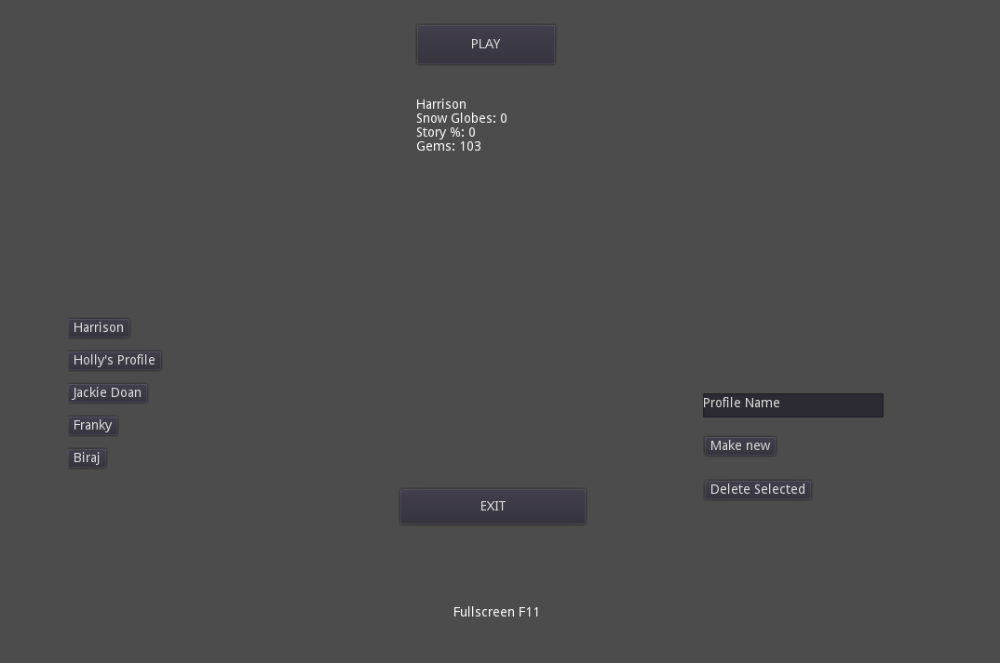
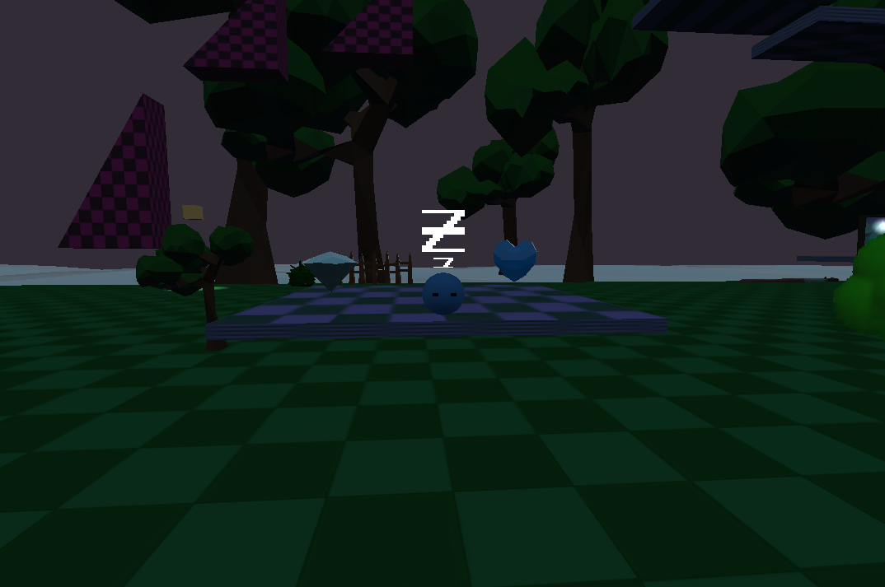
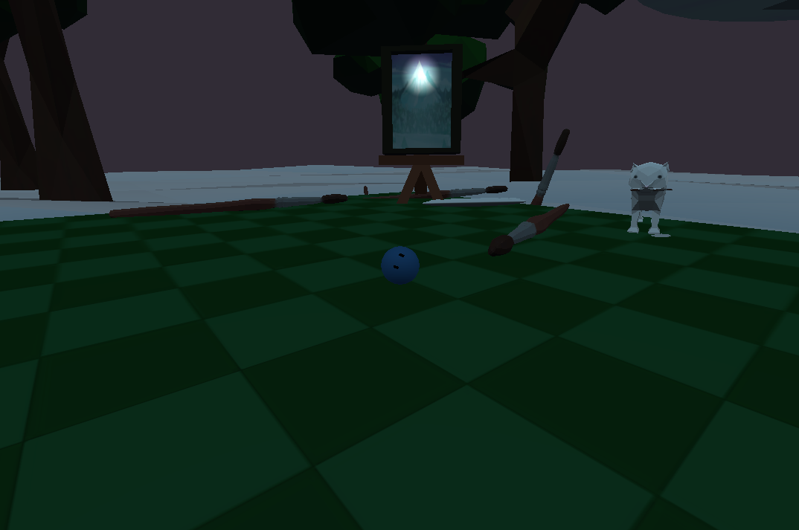
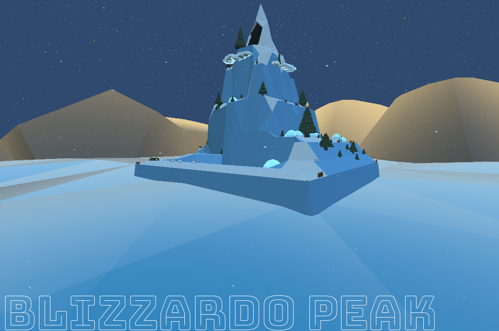
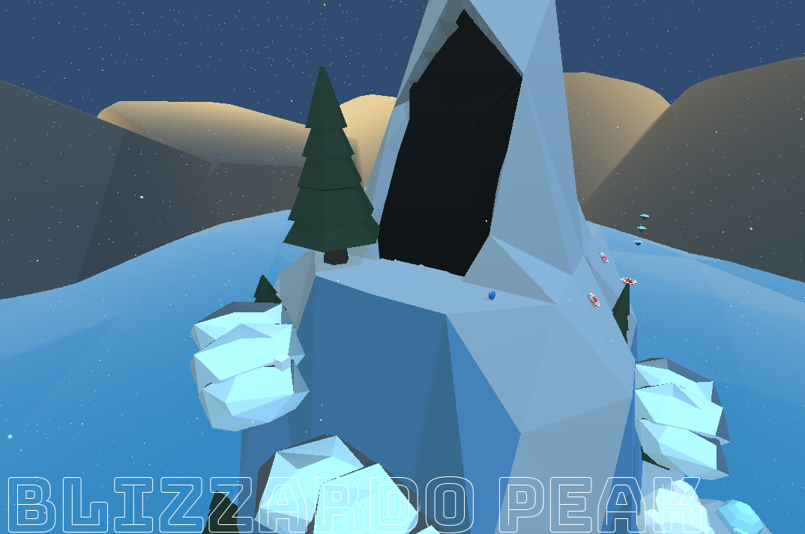
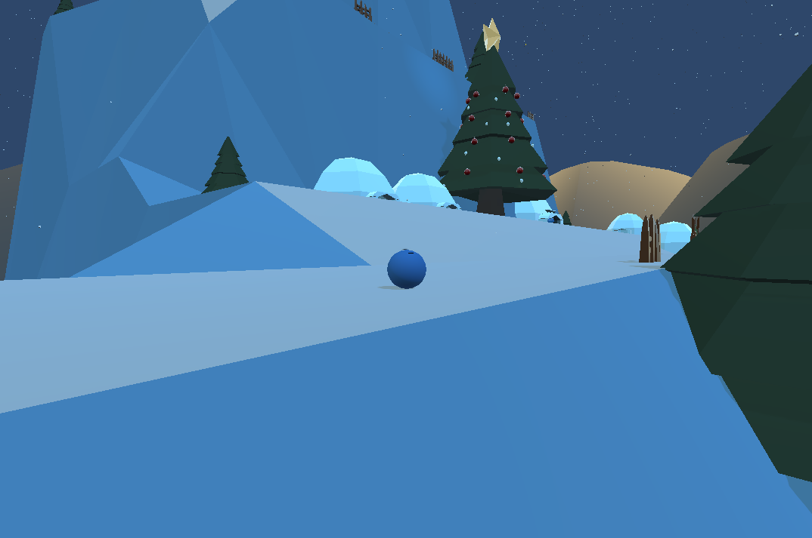
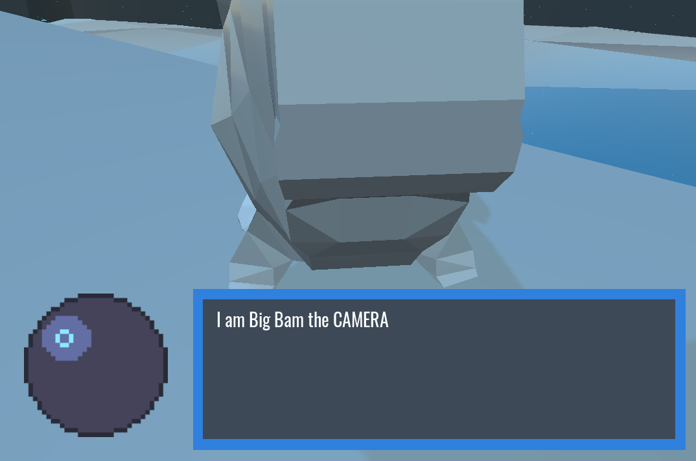
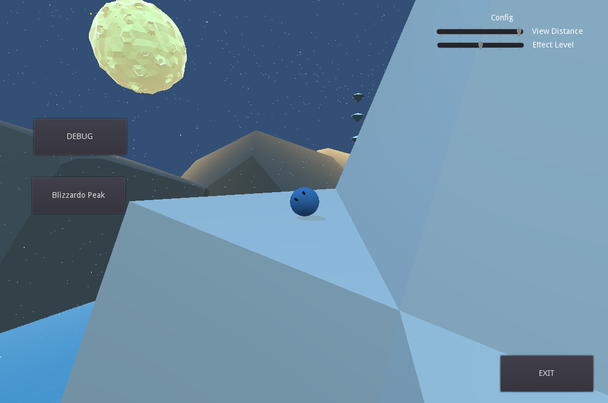

# BallGame Demo
### About
BallGame is a short game demo my friend George Antash (artist)
and I put together during summer 2019 using Godot and Blender.

The game is a simple 3D platformer where the player controls
a marble-like ball. 

Coming from gamemaker I cannot recommend Godot enough. While
it isn't commercially competitive for 3D due to speed among
other reasons, it is still amazingly intuitive to work with. 

### Demo
While the title is underwelming it has a few cool features.

Not only does the title let you create a new profile, but it
hosts a dynamically scrollable selector and displays information
about the profile. 

The debug room is where most features were tested. 

The starting platform is home to both the collectable gem and
a checkpoint heart. The room tests most of the mechanics used
in the first level along with other assets which were originally
being used. The sea in both the debug and mountain level was
created using shaders. 

The painting (not original artwork) is mario 64-style in that 
the player can jump through and enter the first level.

The first level has a cool intro where the camera moves around
the level showing everything off al la super mario. 

The intention for the peak was to lead to another sublevel. 

The stoat village was a unique entry to the level but we never
got around to rigging/animating models. 

The dialogue system would be far from finished in a regular
game, but it had a lot of features for only being used in
a single place. It featured an overlay with dynamically
displaying text and an image. The dialogue was pulled from
an attached json file that described everything from
how the camera moved to how fast the transition was. 

The pause menu was far from complete but has some cool
features such as dynamically changing rendering and level
switching. 

The demo has no formal end but the sandbox structure is 
more than enough fun for something I'll probably never
work on again. 

### Controls
Simple controls. 
| Movement   | Action            |
| :--        | --:               |
| Mouse      | Camera            |
| Scroll     | Zoom              |
| Left-Click | Boost             |
| Space      | Jump/Up-direction |
| Shift      | Down-direction    |
| WASD       | Relative Movement |
